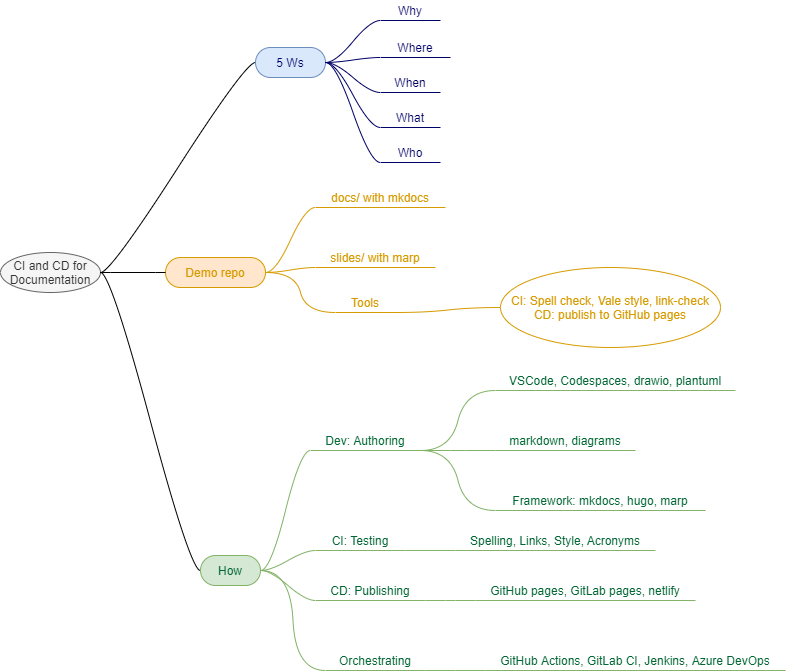

# CI and CD for Documentation

## Purpose

This is the demo repository for All Day DevOps 2020 session on "CI and CD for documentation."

## Brainstorm

Brainstorm on what will be the content of the presentation:

## Slides

[https://documentation-as-code.github.io/ci-cd-for-documentation/](https://documentation-as-code.github.io/ci-cd-for-documentation/)

See also [Marp documentation](https://marpit.marp.app/).
